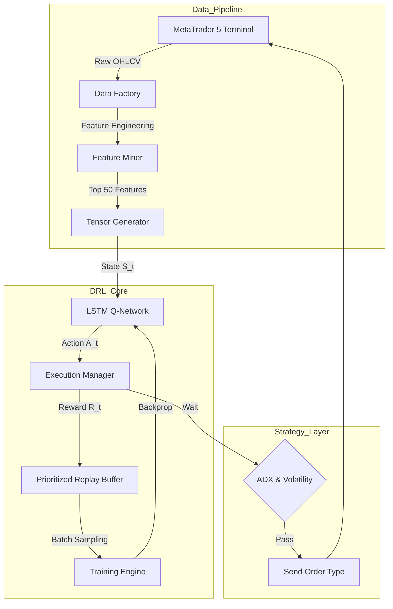

# Deep Multi-Pair Forex Trading System: A Reinforcement Learning Approach

[](https://www.python.org/downloads/release/python-3100/)
[](https://pytorch.org/)
[](https://www.metatrader5.com/en/automated-trading/python)

## 📜 Abstract

This project implements an advanced **Deep Reinforcement Learning (DRL)** agent designed for high-frequency Forex trading. Addressing the stochastic and noisy nature of financial markets, the system employs a novel combination of **Rich Factor Engineering**, **Prioritized Experience Replay (PER)**, and **Mid-Price Target** logic to extract predictive signals from raw OHLCV micro-structure.

The agent is built to overcome common DRL pitfalls in algorithmic trading, such as:
*   **Reward Sparsity:** Solved via Hybrid Tanh Rewards and consistency bonuses.
*   **Noise Overfitting:** Mitigated by training on Mid-Price ($\frac{H+L}{2}$) targets.
*   **Sample Inefficiency:** Addressed by Per-Experience Priority Sampling (PER).

---

## 🚀 Key Features & Innovations

### 1. Rich Factor Universe (Phase 17)
Most trading bots fail because they use standard indicators (RSI, MACD) which lag behind price. We implemented a **"Rich Factor" Miner** inspired by *Mann & Gorse* and *Da Costa & Gebbie*.
*   **Method:** Generates **~2,000 unique features** per symbol.
*   **Logic:** Calculates temporal differences (`diff`), ratios (`ratio`), and inter-column spreads (`spread`) across Fibonacci lags (`1, 2, 3, 5... 34`).
*   **Selection:** Uses **ExtraTreesClassifier** (Randomized Decision Trees) to select the **Top 50** most predictive features based on Gini Importance.

### 2. Prioritized Experience Replay (PER) (Phase 18)
Financial markets are 90% noise and 10% signal. A standard Uniform Replay Buffer wastes computation on "boring" data.
*   **Algorithm:** We implemented **Prioritized Experience Replay** (Schaul et al., 2015).
*   **Priority:** Transitions are prioritized by their TD-Error: $P(i) = (|\delta_i| + \epsilon)^\alpha$.
*   **Optimization:** Uses a **SumTree** data structure for $O(\log N)$ sampling and updating.
*   **Tuning:** $\alpha=0.7$ (Aggressive prioritization for rare geometric patterns).

### 3. Noise-Robust Target (Phase 14)
*   **Problem:** Bid-Ask bounce creates false volatility in the `Close` price.
*   **Solution:** All targets and rewards are calculated on **Mid-Price**.
*   **Effect:** Filters out microstructure noise, allowing the LSTM to learn the "True Trend".

### 4. "Godlike" Scalper Logic (Phase 11-12)
*   **Hybrid Reward:** $R = \tanh(\text{PnL} - \text{Cost}) + \text{ConsistencyBonus}$.
*   **Machine Gunner:** Zero-hesitation execution logic for high-frequency pip capture.
*   **Filters:** ADX Trend Filter & Bollinger Volatility Squeeze detection.

---

## 🏗️ System Architecture



---

## 🛠️ Installation

### Prerequisites
*   Windows OS (Required for MetaTrader 5 Python API)
*   Python 3.10 or higher
*   NVIDIA GPU + CUDA (Highly Recommended for Training)

### Setup
1.  **Clone the Repository:**
    ```bash
    git clone https://github.com/YourRepo/Deep-Forex-RL.git
    cd Deep-Forex-RL
    ```

2.  **Install Dependencies:**
    ```bash
    pip install -r requirements.txt
    ```

3.  **Configure MT5:**
    *   Open `config.py`.
    *   Set `MT5_LOGIN`, `MT5_PASSWORD`, and `MT5_PATH`.
    *   Ensure "Algo Trading" is enabled in your MT5 Terminal settings.

---

## 🎮 Usage Guide

### 1. Feature Mining (Research Phase)
Generate the "Rich Factor" universe and select the best predictors for a currency pair.
```bash
python tools/feature_miner.py --symbol EURUSD --lags 34
```
*Output: Updates `config.py` with top features.*

### 2. Training (Offline Phase)
Train the DRL Agent using historical data and Prioritized Experience Replay.
```bash
python src/trainer.py --symbol EURUSD --epochs 50
```
*Output: Saves model to `models/EURUSD_brain.pth`.*

### 3. Live Trading (Production Phase)
Launch the daemon to trade directly on your MetaTrader 5 account.
```bash
python main.py --mode live
```
*Note: Ensure MT5 Terminal is running.*

### 4. Cloud Training (Colab)
Upload `notebook/colab_training.ipynb` to Google Colab for high-speed GPU training. This notebook is fully synced with the local codebase.

---

## 📂 Project Structure

```text
.
├── config.py               # Global Hyperparameters & Settings
├── requirements.txt        # Python Dependencies
├── main.py                 # Entry Point
├── README.md               # Documentation
│
├── src/                    # Source Code
│   ├── brain.py            # LSTM Q-Network Definition
│   ├── data_factory.py     # Feature Engineering Pipeline
│   ├── live_manager.py     # MT5 Execution Engine
│   ├── per_memory.py       # SumTree & PER Implementation
│   ├── trainer.py          # Training Loop & Validation
│   └── utils.py            # Logging & Helpers
│
├── tools/                  # Research Tools
│   └── feature_miner.py    # Feature Selection Engine
│
└── notebook/               # Cloud Training
    └── colab_training.ipynb
```

---

## 📚 References & Academic Citations

This project is grounded in cutting-edge financial machine learning research.

1.  **Zengeler, N., & Handmann, U. (2020).** Contracts for Difference: A Reinforcement Learning Approach. *Journal of Risk and Financial Management*, 13(4), 78. [https://doi.org/10.3390/jrfm13040078](https://doi.org/10.3390/jrfm13040078)
    *   *Foundation for our Prioritized Experience Replay (PER) implementation.*

2.  **Mann, A. D., & Gorse, D. (n.d.).** A New Methodology to Exploit Predictive Power in (Open, High, Low, Close) Data. *Department of Computer Science, University College London*.
    *   *Basis for our "Rich Factor" feature engineering strategy.*

3.  **Jiang, J., Kelly, B., & Xiu, D. (2020).** (Re-)Imag(in)ing Price Trends. *National Bureau of Economic Research (NBER) Working Paper Series*.
    *   *Inspired our Noise-Robust Mid-Price targeting.*

4.  **Da Costa, J., & Gebbie, T. (2020).** Learning low-frequency temporal patterns for quantitative trading. *arXiv preprint arXiv:2008.09481*.
    *   *Guided our multi-lag temporal difference architecture.*

5.  **Chen, G., Chen, Y., & Fushimi, T. (n.d.).** Application of Deep Learning to Algorithmic Trading. *Stanford University, Institute of Computational and Mathematical Engineering*.

---

## 📄 License

This project is licensed under the **MIT License** - see the [LICENSE](LICENSE) file for details.

*Disclaimer: Financial trading involves significant risk. This software is for educational and research purposes only.*
