# CFD/Forex Trading Bot — Deep Reinforcement Learning

[](https://www.python.org/downloads/release/python-3100/)
[](https://pytorch.org/)
[](https://www.metatrader5.com/en/automated-trading/python)

## Overview

A **Deep Reinforcement Learning** system for trading CFDs (EURUSD, GBPUSD, XAUUSD) via MetaTrader 5. The agent uses a **position-aware LSTM Q-Network** with 4 semantic actions (HOLD, BUY, SELL, CLOSE) and learns trading strategies from raw M5 price data resampled to M15.

### Out-of-Sample Backtest Results

Performance on **completely unseen data** — periods the model never trained on:

| Pair | OOS Period | Balance | ROI | Win Rate | Sharpe (Trade) | Max DD |
|------|-----------|---------|-----|----------|----------------|--------|
| **EURUSD** | 2009 – 2022 | $10k → $69k | +590% | 58.3% | 17.84 | 2.1% |
| **GBPUSD** | 1999 – 2009 | $10k → $52k | +420% | 52.6% | 9.56 | 10.8% |

---

## Architecture

### QNetwork (Position-Aware LSTM)

```
Market State (48×35)  →  Feature Encoder (Linear→GELU→Linear)  →  LSTM (2-layer, 128 hidden)
                                                                          ↓
Trade State (3)  →  [position, bars_held/48, clip(uPnL/100)]  ────→  Concat  →  FC(131→128→64→4)
                                                                                        ↓
                                                                              Q-values: [HOLD, BUY, SELL, CLOSE]
```

| Component | Details |
|-----------|---------|
| Input | 35 engineered features × 48 bar lookback (12h M15) |
| Feature Encoder | `Linear(35→35) → GELU → Linear(35→64)` per timestep |
| LSTM | 2-layer, 128 hidden, dropout 0.25 |
| Trade State | `[position ∈ {-1,0,1}, bars_held_norm, unrealized_pnl_norm]` |
| FC Head | `Linear(131→128) → GELU → Dropout → Linear(128→64) → GELU → Dropout → Linear(64→4)` |
| Output | 4 Q-values: HOLD(0), BUY(1), SELL(2), CLOSE(3) |

### Feature Set (35 Features)

| Category | Count | Features |
|----------|-------|----------|
| Time Structure | 6 | `hour_sin/cos`, `dow_sin/cos`, `session_london/nyc` |
| Returns & Momentum | 5 | `ret_1/5/20`, `rsi_14`, `roc_10` |
| Mean Reversion | 4 | `zscore_20/50`, `bb_position`, `vwap_deviation` |
| Trend Regime | 4 | `dist_ema_20/50`, `ema_slope_20`, `adx_14` |
| Volatility | 4 | `atr_normalized`, `bb_width`, `volatility_ratio`, `atr_percentile` |
| Candle Structure | 3 | `body_ratio`, `upper_wick_ratio`, `lower_wick_ratio` |
| Volume Dynamics | 3 | `volume_ratio`, `volume_trend`, `price_volume_corr` |
| Session Context | 4 | `dist_session_high/low`, `session_range_position/ratio` |
| Multi-TF | 2 | `h1_trend`, `h1_momentum` |

---

## Training

Training runs on **Google Colab** (GPU) using the self-contained notebook. Key design decisions:

### Anti-Overfit Measures

| Technique | Setting | Purpose |
|-----------|---------|---------|
| **Linear ε-decay** | `ε = max(0.05, 1 − step/750k)` | Explore for ~7 epochs, not 1 |
| **Trade penalty** | −0.5 per position change | Discourage churning |
| **Holding bonus** | +0.1 per bar if held > 4 bars | Encourage patience |
| **Weight decay** | Adam `weight_decay=1e-4` | L2 regularization |
| **Dropout** | 0.25 | Prevent co-adaptation |
| **Train frequency** | 1 update per 8 steps | Reduce overfit to replay buffer |
| **Long rollouts** | 2000 bars × 50 episodes/epoch | Learn full trade lifecycles |

### Training Pipeline

```mermaid
graph LR
    A[M5 CSV] --> B["Resample M15"]
    B --> C["Feature Engineering (35 features)"]
    C --> D["Mini-Rollouts (50 × 2000 bars)"]
    D --> E["ε-greedy Action Selection"]
    E --> F["TradingEnv (position-aware)"]
    F --> G["PER Buffer (100k capacity)"]
    G --> H["DDQN Train Step (batch 256)"]
    H --> I["Soft Target Update (τ=0.005)"]
    I --> J["Validate on held-out data"]
    J --> K["Early stopping on Val Sharpe"]
```



### Colab Workflow

```bash
# 1. Extract data from MT5 (local)
python notebook/extract_data.py

# 2. Upload CSV + notebook to Colab
#    notebook/data/{PAIR}.csv → /content/{PAIR}.csv
#    notebook/colab_training.ipynb → Colab

# 3. Run all cells (GPU runtime)
#    Output: best_{PAIR}.pt

# 4. Download model to models/ directory
```

### Regenerating the Notebook

The notebook is generated programmatically to stay in sync with the codebase:

```bash
python tools/gen_colab.py
# Output: notebook/colab_training.ipynb
```

---

## Backtesting

```bash
# In-sample validation (last 20% of training window)
python src/backtester.py --pair EURUSD

# Out-of-sample test (data BEFORE training window)
python src/backtester.py --pair EURUSD --oos

# Custom training window size
python src/backtester.py --pair GBPUSD --oos --train-bars 400000
```

**Backtester features:**
- 1-bar execution latency simulation
- Realistic spread, commission, slippage
- ATR-based Stop-Loss & Take-Profit
- Overnight swap costs
- Equity curve + drawdown plots saved to `backtest_{PAIR}[_oos].png`

---

## Live Trading

```bash
python src/live_manager.py
```

The live manager:
- Auto-discovers models: `best_{PAIR}.pt` → `{PAIR}_brain.pth` → `{PAIR}_brain_live.pth`
- Builds **trade_state** from real MT5 positions (syncs direction, entry price, bars held)
- Resamples incoming M5 data → M15, computes features in real-time
- Applies ATR-based SL/TP, spread filter
- **Online learning**: adapts model weights to live market with tiny LR (`1e-6`)
- Saves online-updated models hourly to `{PAIR}_brain_live.pth`

---

## Project Structure

```text
.
├── config.py                  # Pair configs, features, hyperparameters
├── requirements.txt           # Python dependencies
├── README.md
│
├── src/
│   ├── brain.py               # Position-aware LSTM QNetwork
│   ├── data_factory.py        # MT5 data fetch + 35-feature engineering + M5→M15 resample
│   ├── backtester.py          # Backtest with latency, spread, SL/TP, swap costs
│   ├── live_manager.py        # MT5 live execution, position tracking, online learning
│   ├── trainer.py             # Local training loop with PER
│   ├── per_memory.py          # SumTree + Prioritized Experience Replay
│   ├── validator.py           # Validation metrics (Sharpe, returns, trades)
│   └── utils.py               # Logging
│
├── tools/
│   ├── gen_colab.py           # Generates Colab notebook from code
│   └── feature_miner.py       # Feature importance analysis
│
├── notebook/
│   ├── colab_training.ipynb   # Self-contained Colab training notebook
│   ├── extract_data.py        # Export MT5 data to CSV for Colab upload
│   └── data/                  # CSV data files ({PAIR}.csv)
│
└── models/                    # Trained model weights
    ├── best_{PAIR}.pt         # Models from Colab training
    └── {PAIR}_brain_live.pth  # Online-updated models from live trading
```

---

## Configuration

Key settings in `config.py`:

```python
PAIR_CONFIGS = {
    'XAUUSD': {'scaling_factor': 5.0,     'contract_size': 100,    'spread': 0.20},
    'EURUSD': {'scaling_factor': 10000.0, 'contract_size': 100000, 'spread': 0.0001},
    'GBPUSD': {'scaling_factor': 10000.0, 'contract_size': 100000, 'spread': 0.0002},
}

SEQUENCE_LENGTH = 48      # 12h lookback (M15)
BATCH_SIZE = 256           # GPU-optimized
EPISODE_LENGTH = 2000      # ~21 days per mini-rollout
EPISODES_PER_EPOCH = 50    # 100k steps/epoch
GAMMA = 0.95               # Long-horizon discount
ATR_SL_MULTIPLIER = 2.5    # Stop-loss at 2.5× ATR
ATR_TP_MULTIPLIER = 3.0    # Take-profit at 3.0× ATR
```

---

## Installation

### Prerequisites
- **Windows** (required for MetaTrader 5 Python API)
- Python 3.10+
- NVIDIA GPU + CUDA (recommended for training, not required for live)

### Setup

```bash
git clone <repo-url>
cd RL
pip install -r requirements.txt
```

Configure MT5 credentials in `config.py`: `MT5_LOGIN`, `MT5_PASSWORD`, `MT5_PATH`.

---

## References

1. **Schaul, T., Quan, J., Antonoglou, I., & Silver, D. (2016).** Prioritized Experience Replay. *ICLR 2016*. [arXiv:1511.05952](https://arxiv.org/abs/1511.05952)
   — *Foundation for PER buffer implementation.*

2. **Zengeler, N., & Handmann, U. (2020).** Contracts for Difference: A Reinforcement Learning Approach. *JRFM*, 13(4), 78. [DOI:10.3390/jrfm13040078](https://doi.org/10.3390/jrfm13040078)
   — *CFD-specific RL reward design, live epsilon exploration.*

3. **Mann, A. D., & Gorse, D.** A New Methodology to Exploit Predictive Power in (Open, High, Low, Close) Data. *UCL*.
   — *Basis for feature engineering approach.*

4. **Da Costa, J., & Gebbie, T. (2020).** Learning low-frequency temporal patterns for quantitative trading. *arXiv:2008.09481*.
   — *Multi-lag temporal architecture, online gradient descent for live adaptation.*

5. **Chen, G., Chen, Y., & Fushimi, T.** Application of Deep Learning to Algorithmic Trading. *Stanford ICME*.
   — *LSTM-based Q-learning for sequential decision making in markets.*

6. **Van Hasselt, H., Guez, A., & Silver, D. (2016).** Deep Reinforcement Learning with Double Q-learning. *AAAI 2016*. [arXiv:1509.06461](https://arxiv.org/abs/1509.06461)
   — *DDQN architecture used to reduce action-value overestimation.*

---

*Last updated: 2026-02-18*
